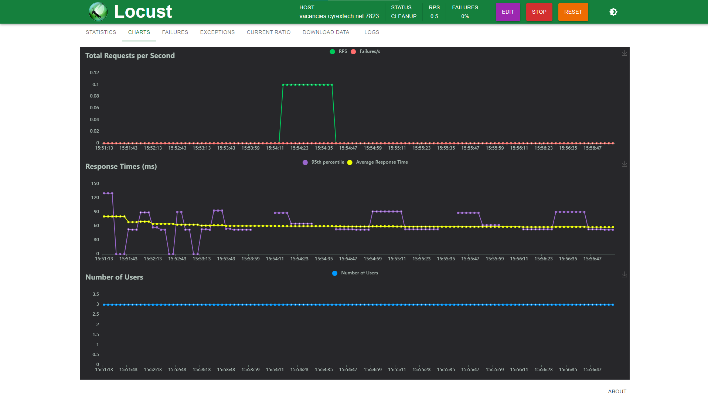

# LoadTestCyrex

LoadTestCyrex is a performance testing tool for gRPC services using Locust. This project provides various client scripts and configurations for testing authentication, vacancy creation, and other operations through gRPC.




## Project Structure

```
LoadTestCyrex/
├── config/
│   └── task.config
├── src/
│   ├── __init__.py
│   ├── clients/
│   │   ├── __init__.py
│   │   ├── locust_client.py
│   │   ├── messages_client.py
│   │   ├── service_client.py
│   ├── protos/
│   │   ├── __init__.py
│   │   ├── proto/
│   │   ├── auth_service_pb2_grpc.py
│   │   ├── auth_service_pb2.py
│   │   ├── rpc_create_vacancy_pb2_grpc.py
│   │   ├── rpc_create_vacancy_pb2.py
│   │   ├── rpc_signin_user_pb2_grpc.py
│   │   ├── rpc_signin_user_pb2.py
│   │   ├── rpc_signup_user_pb2_grpc.py
│   │   ├── rpc_signup_user_pb2.py
│   │   ├── rpc_update_vacancy_pb2_grpc.py
│   │   ├── rpc_update_vacancy_pb2.py
│   │   ├── user_pb2_grpc.py
│   │   ├── user_pb2.py
│   │   ├── user_service_pb2_grpc.py
│   │   ├── user_service_pb2.py
│   ├── utils/
│   │   ├── __init__.py
│   │   ├── utils.py
│   └── main.py
├── playgrounds/
│   ├── auth_client.py
│   ├── auto_create_mail_and_sign_up.py
│   ├── create_vacancy.py
│   ├── delete_vacancy.py
│   ├── email_listener.py
│   ├── get_me.py
│   ├── get_vacancies.py
│   ├── get_vacancy.py
│   ├── signin_from_json.py
│   ├── update_vacancy.py
├── .env
├── README.md
├── requirements.txt
├── generate_protos.py
├── Dockerfile
└── docker-compose.yml
```

## Setup

1. Clone the repository:
    ```sh
    git clone https://github.com/oaslananka/LoadTestCyrex.git
    cd LoadTestCyrex
    ```

2. Create and activate a virtual environment:
    ```sh
    python -m venv venv
    source venv/bin/activate  # On Windows use `venv\Scripts\activate`
    ```

3. Install the required packages:
    ```sh
    pip install -r requirements.txt
    ```

4. Set up environment variables:
    Create a `.env` file in the root directory and add the following:
    ```ini
    TestUser_1_Email=user1@example.com
    TestUser_1_Password=pass1
    TestUser_2_Email=user2@example.com
    TestUser_2_Password=pass2
    USER_3_EMAIL=user3@example.com
    USER_3_PASSWORD=pass3
    ```

5. Compile the `.proto` files:
    ```sh
    python generate_protos.py
    ```

## Running Tests

To run the performance tests using Locust, use the following command:
```sh
locust -f src/main.py --config config/task.config
```

## Docker Setup

To run the project using Docker, follow these steps:

1. Ensure Docker is installed on your system.

2. Build the Docker image and start the container:
    ```sh
    docker-compose build
    docker-compose up
    ```

3. Access the Locust web interface:
   Open your browser and navigate to [http://localhost:8089](http://localhost:8089)

### Dockerfile

The `Dockerfile` is used to create the Docker image for the project:

```dockerfile
# Base image
FROM python:3.9-slim

# Set environment variables
ENV PYTHONDONTWRITEBYTECODE 1
ENV PYTHONUNBUFFERED 1

# Set work directory
WORKDIR /usr/src/app

# Install dependencies
COPY requirements.txt /usr/src/app/
RUN pip install --no-cache-dir -r requirements.txt

# Copy project
COPY . /usr/src/app/

# Compile proto files
RUN python generate_protos.py

# Expose the port for Locust
EXPOSE 8089

# Run Locust
CMD ["locust", "-f", "src/main.py", "--config", "config/task.config"]
```

### docker-compose.yml

The `docker-compose.yml` file defines the Docker services for the project:

```yaml
version: '3.8'

services:
  loadtestcyrex:
    build: .
    ports:
      - "8089:8089"
    volumes:
      - .:/usr/src/app
    environment:
      - TestUser_1_Email=user1@example.com
      - TestUser_1_Password=pass1
      - TestUser_2_Email=user2@example.com
      - TestUser_2_Password=pass2
      - USER_3_EMAIL=user3@example.com
      - USER_3_PASSWORD=pass3
```

## Playground Scripts

The `playgrounds` directory contains various scripts for testing and experimenting with the LoadTestCyrex project. Each script is well-documented and can be run individually to test different functionalities of the project.

## Contributing

Contributions are welcome! Please feel free to submit a Pull Request.

## License

This project is licensed under the MIT License.
